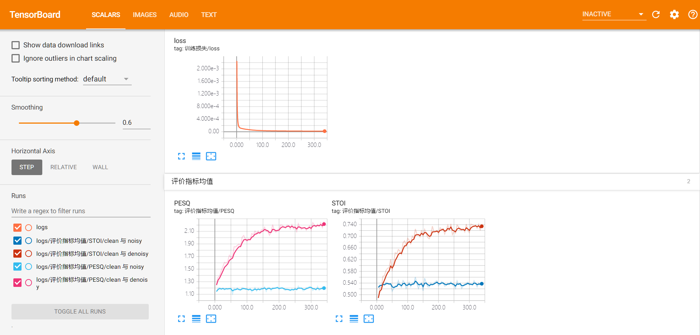

# Wave-U-Net-for-Speech-Enhancement

Implement [Wave-U-Net](https://arxiv.org/abs/1806.03185) by PyTorch, and migrate it to the speech enhancement area.




## 环境与依赖


```shell
# 确保 CUDA 的 bin 目录添加到 PATH 环境变量中
# 通过附加 LD_LIBRARY_PATH 环境变量来安装 CUDA 附带的 CUPTI
export PATH="/usr/local/cuda-10.0/bin:$PATH"
export LD_LIBRARY_PATH="/usr/local/cuda-10.0/lib64:$LD_LIBRARY_PATH"

# 安装 Anaconda，以清华镜像源，python 3.6.5为例
wget https://mirrors.tuna.tsinghua.edu.cn/anaconda/archive/Anaconda3-5.2.0-Linux-x86_64.sh
chmod a+x Anaconda3-5.2.0-Linux-x86_64.sh
./Anaconda3-5.2.0-Linux-x86_64.sh # 按 f 翻页，默认安装在 ~/anaconda 目录下，安装过程会提示修改 PATH 变量

# Create env
conda create -n wave-u-net python=3
conda activate wave-u-net

# Install deps
conda install pytorch torchvision cudatoolkit=10.0 -c pytorch
conda install tensorflow-gpu
conda install matplotlib
pip install tqdm librosa
pip install pystoi # for STOI metric
pip install pesq # for PESQ metric

# 配置好环境与依赖之后，可以拉取代码
git clone https://github.com/haoxiangsnr/Wave-U-Net-for-Speech-Enhancement.git
```

## 使用方法

当前项目有三个入口文件：

- 用于训练模型的入口文件：`train.py`
- 用于增强带噪语音的入口文件：`enhancement.py`
- 用于测试模型降噪能力的入口文件（TODO）：`test.py`

### 训练

使用 `train.py` 训练模型，它接收四个命令行参数：

- `-h`，显示帮助信息
- `-C, --config`，指定训练所需的配置文件
- `-D, --device`，指定训练过程中可见的 GPU，GPU 编号从 0 开始，例如："0,1,2,3"
- `R, --resume`，从最近一次保存的模型断点处继续训练

语法：`python train.py [-h] -C CONFIG [-D DEVICE] [-R]`

例如：

```shell script
python train.py -C config/train.json -D 0,1,2,3
# 训练模型所用的配置文件为 config/train.json
# 训练中可见的 GPU 是索引为 0,1,2,3 的 GPU

python train.py -C config/train.json -D 1,2,3 -R
# 训练模型所用的配置文件为 config/train.json
# 训练中可见的 GPU 是索引为 1,2,3 的 GPU
# 从最近一次保存的模型断点继续训练
```

补充：
- 一般将训练所需要的配置文件放置于 `config/train/` 目录下
- 训练配置文件中的参数见“参数说明”部分
- 配置文件的文件名即是实验名

### 增强

使用 `enhancement.py` 来增强带噪语音，它接收以下参数：

-  `-h, --help`，显示帮助信息
-  `-C, --config`，指定增强语音所用的模型，以及被增强的数据集。
- `-D, --device`，增强所用的 GPU 索引，-1 表示使用 CPU
- `-O, --output_dir`，指定在哪里存储增强后的语音，需要确保这个目录提前存在
- `-M, --model_checkpoint_path`，模型断点的路径，拓展名为 .tar 或 .pth

语法：`python enhancement.py [-h] -C CONFIG [-D DEVICE] -O OUTPUT_DIR -M MODEL_CHECKPOINT_PATH`

例如：

```shell script
python enhancement.py -C config/enhancement/unet_basic.json -D 0 -O enhanced -M /media/imucs/DataDisk/haoxiang/Experiment/Wave-U-Net-for-Speech-Enhancement/smooth_l1_loss/checkpoints/model_0020.pth
# 增强语音所用的配置文件为 config/enhancement/unet_basic.json，使用这个文件可以指定增强所需的模型以及数据集信息
# 使用索引为 0 的 GPU
# 输出的目录为 enhanced/，该目录需要提前新建好
# 指定模型断点的路径

python enhancement.py -C config/enhancement/unet_basic.json -D -1 -O enhanced -M /media/imucs/DataDisk/haoxiang/Experiment/Wave-U-Net-for-Speech-Enhancement/smooth_l1_loss/checkpoints/model_0020.tar
# 使用 CPU 来增强语音
```

补充：
- 一般将增强所需要的配置文件放置于 `config/enhancement/` 目录下
- 增强配置文件中的参数见“参数说明”部分

### 测试

TODO


## 可视化

训练中产生的所有日志信息都会存储至`config["save_location"]/<config_filename>/`目录下。假设用于训练的配置文件为`config/train/sample_16384.json`，`sample_16384.json`中`save_location`参数的值为`/home/UNet/`，那么当前实验训练过程中产生的日志会存储在 `/home/UNet/sample_16384/` 目录下。
该目录会包含以下内容：

- `logs/`目录: 存储 Tensorboard 相关的数据，包含损失曲线，波形文件，语音文件等
- `checkpoints/`目录: 存储模型的所有断点，后续可从这些断点处重启训练或进行语音增强
- `config.json`文件: 训练配置文件的备份

在训练过程中可以使用 `tensorboard` 来启动一个静态的前端服务器，可视化相关目录中的日志数据:

```shell script
tensorboard --logdir config["save_location"]/<config_filename>/

# 可使用 --port 指定 tensorboard 静态服务器的启动端口
tensorboard --logdir config["save_location"]/<config_filename>/ --port <port>

# 例如，配置文件中的 "save_location" 参数为 "/home/happy/Experiments"，配置文件名为 "train_config.json"，修改默认端口为 6000
# 可使用如下命令：
tensorboard --logdir /home/happy/Experiments/train_config --port 6000
```

## 目录说明

在项目运行过程，会产生多个目录，均有不同的用途：

- 主目录：当前 README.md 所在的目录，存储着所有源代码
- 训练目录：训练配置文件中的`config["save_location"]`目录，存储当前项目的所有实验日志和模型断点
- 实验目录：`config["save_location"]/<实验名>/`目录，存储着某一次实验的日志信息


## 参数说明
### 训练

`config/train/<实验名>.json`，训练过程中产生的日志信息会存放在`config["save_location"]/<实验名>/`目录下

```json5
{
    "seed": 0, // 保证实验可重复性的随机种子
    "description": "attempt",  // 实验描述，后续会显示在 Tensorboard 中
    "save_location": "/media/imucs/DataDisk/haoxiang/Experiment/Wave-U-Net-for-Speech-Enhancement", // 当前实验项目的存储位置
    "n_gpu": 4, // 实际使用的 GPU 数量，应小于或等于 train.py -D 参数指定的可见数量
    "use_cudnn": true, // 是否使用 CuDNN，使用 CuDNN 无法保证实验可重复性
        "trainer": { // 训练过程
        "epochs": 1000, // 训练的上限
        "save_checkpoint_interval": 10, // 模型断点的缓存间隔
        "validation_interval": 10, // 验证的间隔
        "visualize_audio_limit": 30, // 验证时可视化音频的间隔，之所以设置这个参数，是因为可视化音频比较慢
        "visualize_waveform_limit": 30, // 验证时可视化波形的间隔，之所以设置这个参数，是因为可视化波形比较慢
        "find_max": true // 当 find_max 为 true 时，如果计算出的评价指标为已知的最大值，就会将当前轮次的模型断点另外缓存一份
        },
    "model": {
        "module": "model.unet_basic", // 放置模型的文件
        "main": "UNet", // 文件内的具体模型类
        "args": {} // 传给模型类的参数
    },
    "loss_function": {
        "module": "model.loss",
        "main": "mse_loss",
        "args": {}
    },
    "optimizer": {
        "lr": 0.0002,
        "beta1": 0.9
    },
    "train_dataset": {
        "module": "dataset.waveform_dataset", // 存放训练集类的文件
        "main": "WaveformDataset", // 训练集类
        "args": { // 传递给训练集类的参数，详见具体的训练集类
            "dataset": "/home/imucs/Datasets/2019-09-03-timit_train-900_test-50/train.txt",
            "limit": null,
            "offset": 0,
            "sample_length": 16384,
            "train": true 
        }
    },
    "validation_dataset": {
        "module": "dataset.waveform_dataset",
        "main": "WaveformDataset",
        "args": {
            "dataset": "/home/imucs/Datasets/2019-09-03-timit_train-900_test-50/test.txt",
            "limit": 400,
            "offset": 0,
            "sample_length": 16384,
            "train": false,
        }
    },
    "train_dataloader": {
        "shuffle": true,
        "num_workers": 40, // 开启多少个线程对数据进行预处理
        "batch_size": 800
    },
    "validation_dataloader": {
        "num_workers": 0, // 直接由主进程加载
        "batch_size": 1
    }
}
```

### 增强

`config/enhancement/*.json`

```json5
{
    "model": {
        "module": "model.unet_basic", // 放置模型的文件
        "main": "UNet",// 文件内的具体模型类
        "args": {} // 传给模型类的参数
    },
    "dataset": {
        "module": "dataset.waveform_dataset", // 增强使用的数据集类
        "main": "WaveformDataset", // 传递给数据集类的参数，详见具体的训练集类
        "args": {
            "dataset": "/home/imucs/Datasets/2019-09-03-timit_train-900_test-50/enhancement.txt",
            "limit": 400,
            "offset": 0,
            "sample_length": 16384
        }
    }
}
```

在增强时，存储数据集路径的 txt 文件仅仅指定带噪语音的路径即可，类似这样：

```text
# enhancement.txt

/home/imucs/tmp/UNet_and_Inpainting/0001_babble_-7dB_Clean.wav
/home/imucs/tmp/UNet_and_Inpainting/0001_babble_-7dB_Enhanced_Inpainting_200.wav
/home/imucs/tmp/UNet_and_Inpainting/0001_babble_-7dB_Enhanced_Inpainting_270.wav
/home/imucs/tmp/UNet_and_Inpainting/0001_babble_-7dB_Enhanced_UNet.wav
/home/imucs/tmp/UNet_and_Inpainting/0001_babble_-7dB_Mixture.wav
```

## TODO

- [x] 使用全长语音进行验证
- [x] 增强脚本
- [ ] 测试脚本
